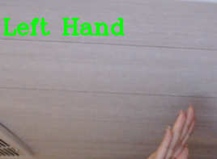
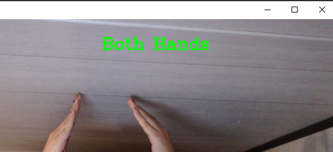

# Computer_Vision_Hand_Detection
Using computer vision to detect right hand, left hand or both hands

## Where to find the tutorial - Right and Left Hand Detection Using Python
You can find tutorial for this project on [GeeksForGeeks](https://www.geeksforgeeks.org/right-and-left-hand-detection-using-python/) 
Note: Please review the file I uploaded because this tutorial gives you an error on line 49.

## Introduction
### pip install mediapipe  
### pip install opencv-python

## How It Works

## Notes
Remember to press "q" to close the application.
