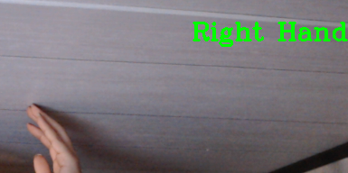

# Computer_Vision_Hand_Detection
Using computer vision to detect right hand, left hand or both hands

## Where to find the tutorial - Right and Left Hand Detection Using Python
You can find tutorial for this project on [GeeksForGeeks](https://www.geeksforgeeks.org/right-and-left-hand-detection-using-python/) 
— Note: Please review the file I uploaded because this tutorial gives you an error on line 49.

### Introduction
```
pip install mediapipe  
pip install opencv-python
```
# Importing Libraries
```
import cv2
import mediapipe as mp
from google.protobuf.json_format import MessageToDict
```

—— These lines import the necessary libraries for the project.
cv2 is OpenCV, a powerful library for computer vision tasks.
mediapipe is a library that offers various pre-built solutions for media processing tasks.
MessageToDict is a function from google.protobuf.json_format used to convert protobuf messages to dictionaries.

# Initializing the Model
```
mpHands = mp.solutions.hands
hands = mpHands.Hands(
    static_image_mode=False,
    model_complexity=1,
    min_detection_confidence=0.75,
    min_tracking_confidence=0.75,
    max_num_hands=2)
```

—— Here, we initialize the Hand Tracking model from Mediapipe.
We set various parameters to configure the model's behavior, such as model complexity and confidence thresholds.

# Start capturing video from webcam
```
cap = cv2.VideoCapture(0)
```
—— We initiate capturing video from the webcam using OpenCV's VideoCapture.

# Main loop
```
while True:
    # Read video frame by frame
    success, img = cap.read()

    # Flip the image(frame)
    img = cv2.flip(img, 1)

    # Convert BGR image to RGB image
    imgRGB = cv2.cvtColor(img, cv2.COLOR_BGR2RGB)

    # Process the RGB image
    results = hands.process(imgRGB)
```
——  This is the main loop that captures and processes video frames in real-time.
We read a frame from the webcam using cap.read(), and then flip it horizontally for intuitive display.
The color format is converted from BGR to RGB.
The frame is processed using the Hand Tracking model, and results are stored in the results variable.

# We check if hands are detected
```
# Handle the presence of hands
if results.multi_hand_landmarks:
```
—— Here, we check if hands are detected in the processed frame using results.multi_hand_landmarks.
If hands are present, we proceed with handling the visual cues.

# Display Video and when 'q' is entered, destroy the window
```
cv2.imshow('Image', img)

if cv2.waitKey(1) & 0xff == ord('q'):
    break

```
—— We display the processed frame using cv2.imshow().
The loop waits for user input. If 'q' is pressed, the loop breaks and the application ends.

# Release the webcam and close the OpenCV window
```
cap.release()
cv2.destroyAllWindows()
```
—— After the loop, we release the webcam using cap.release() to free up resources.
We also close any OpenCV windows using cv2.destroyAllWindows().
    
### How It Works




### Notes
Remember to press "q" to close the application.

## Authors

* **hpankur02** - *Initial work* - [Right and Left Hand Detection Using Python]([https://gist.github.com/rsalaza4/a7dfb75fedca3aeb95c5cbe4bad618ce](https://www.geeksforgeeks.org/right-and-left-hand-detection-using-python/))
* **Crystal14w** - *Edited* - [Computer Vision Python Script]([https://github.com/Crystal14w/Resume_Scanner_Python/blob/patch_1/Job_Posting_KeyTerms.py](https://github.com/Crystal14w/Computer_Vision_Hand_Detection)) 

## Acknowledgments

*Thanks to hpankur02 for publishing an informative article on computer vision.
